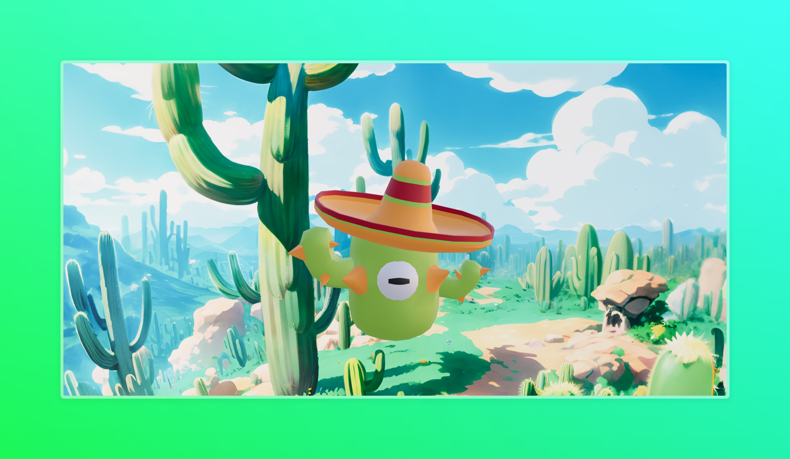

# 3D Pokemon Portal 🌟


## 📖 Description

3D Pokemon Portal is a web application that allows users to explore and learn about different Pokemon. Built with React and Vite, this project provides an interactive interface for Pokemon enthusiasts.


## ✨ Features

- Browse Pokemon catalog
- View detailed Pokemon information
- Responsive design
- Fast performance with Vite
- Modern UI/UX

## 🚀 Getting Started



### Prerequisites

- Node.js (v14 or higher)
- npm or yarn

### Installation

1. Clone the repository:
```bash
git clone https://github.com/pakagronglb/3d-pokemon-portal.git
cd 3d-pokemon-portal
```

2. Install dependencies:
```bash
npm install
```

3. Start the development server:
```bash
npm run dev
```

4. Start the development server
```bash
npm run dev
```

5. Open your browser and visit `http://localhost:5173`


## 🔧 Configuration

The project uses Vite as the build tool. Configuration can be modified in the `vite.config.js` file.


## 📝 Contributing

1. Fork the project
2. Create your feature branch (`git checkout -b feature/AmazingFeature`)
3. Commit your changes (`git commit -m 'Add some AmazingFeature'`)
4. Push to the branch (`git push origin feature/AmazingFeature`)
5. Open a Pull Request

## 📜 License

This project is licensed under the MIT License - see the [LICENSE](LICENSE) file for details.

## 🙏 Acknowledgments

- Tutorial inspiration from [Wawa Sensei](https://youtu.be/2W_VR92Pqgs)
- Pokemon data provided by [PokeAPI](https://pokeapi.co/)
- Icons and badges from [Shields.io](https://shields.io/)

## 👤 Author

- GitHub: [@pakagronglb](https://github.com/pakagronglb)

---
⭐️ From [Pakagrong Lebel](https://github.com/pakagronglb)

